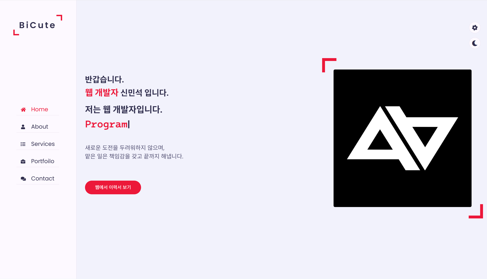
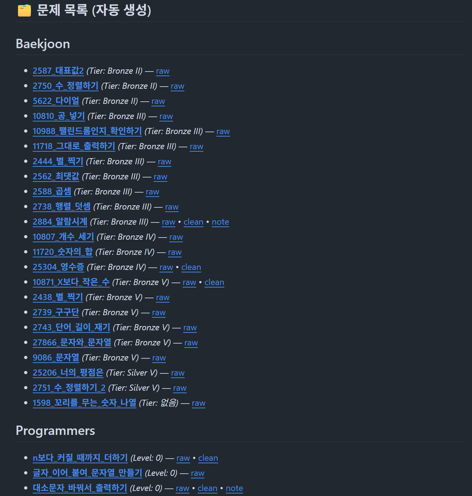

  

  <h3>👋 안녕하세요! 개발자를 꿈꾸는 신민석입니다.</h3>
  
한신대학교 AISW계열 재학 중 | 창의적인 아이디어를 기술로 구현합니다.

  
  

 

  
<strong>"유연한 사고, 끝까지 완수하는 책임감, 꼼꼼한 성실함"</strong>

  

## 🧠 About Me
- 🌱 **도전을 즐기며 배우는 개발자 지망생**
- 💡 **아이디어를 기술로 실현하는 과정**을 좋아합니다.
- 🔍 코드의 세부적인 흐름을 이해하고, 개선점을 찾아내는 데 흥미를 느낍니다.
- 🎯 **Goal:** AI + 소프트웨어 융합 분야의 창의적인 개발자

## ⚡ Highlights
- 🧩 **문제 해결:** 오류의 근본 원인을 분석하고 기록합니다.
- 💬 **협업:** GitHub Issue, Notion을 활용해 투명하게 소통합니다.
- 🕹️ **실천:** 이론보다 프로젝트 실습을 통해 개념을 검증합니다.
- 🌍 **적용:** 새로운 기술을 배우면 토이 프로젝트에 즉시 적용합니다.

## 🎓 Education
**한신대학교 (Hanshin University)**
- AISW계열 (2025.03 ~ 재학중)
- 관심분야: 인공지능, 소프트웨어 공학, 데이터 분석, 보안

## 🌱 Roadmap
- [ ] **C 언어:** 기초 및 포인터 완전 정복
- [ ] **Algorithm:** 백준 단계별 문제 풀이 (Solved.ac)
- [ ] **Python:** 데이터 처리 및 웹 스크래핑 실습
- [ ] **Web:** HTML/CSS → JavaScript 확장

 

## 🛠️ Tech Stacks

### Languages
  

### Tools & Environment
   

 

## 📊 Stats & Algorithm

  
   
  

 

  

 

## 💻 Projects

### 📂 Information Website
> 포트폴리오·자기소개 정적 사이트
- **Stack:** HTML, CSS
- **Repo:** [hamsdgfh_information](https://github.com/hamsdgfh/hamsdgfh_information)

<strong>🖼️ 스크린샷 보기</strong>

 

---

### 📂 C Study Repository
> C 언어 알고리즘 학습 및 문제 풀이 기록
- **Stack:** C
- **Repo:** [c-algorithm-study](https://github.com/hamsdgfh/c-algorithm-study)

<strong>🖼️ 스크린샷 보기</strong>

 

 

## 📞 Contact

  
  

 

  ✨ 함께 성장하는 개발자가 되겠습니다. 방문해주셔서 감사합니다! ✨

  

